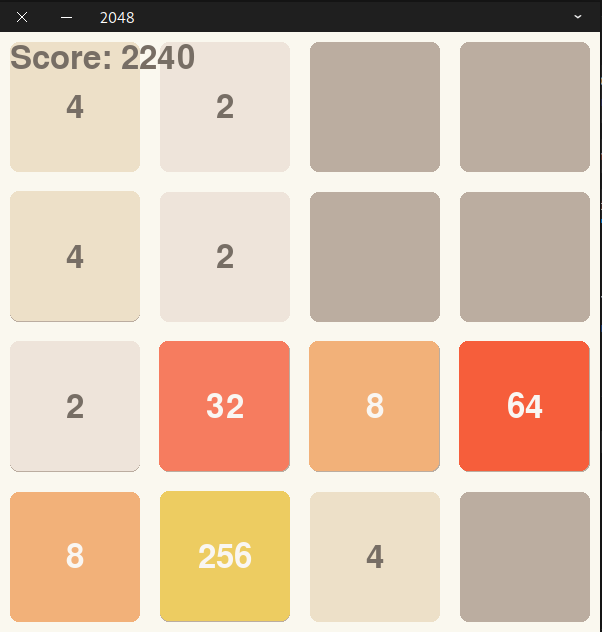

# 2048 Game

A modern implementation of the classic 2048 game using Python and Pygame.

## Features
- Smooth animations
- Modern color scheme
- Score tracking
- Game over detection
- Responsive controls

## How to Play
1. Install requirements: `pip install -r requirements.txt`
2. Run the game: `python game.py`
3. Use arrow keys to move tiles
4. Press 'R' to restart
5. Press 'Q' to quit

## Controls
- ↑ (Up Arrow): Move tiles up
- ↓ (Down Arrow): Move tiles down
- ← (Left Arrow): Move tiles left
- → (Right Arrow): Move tiles right
